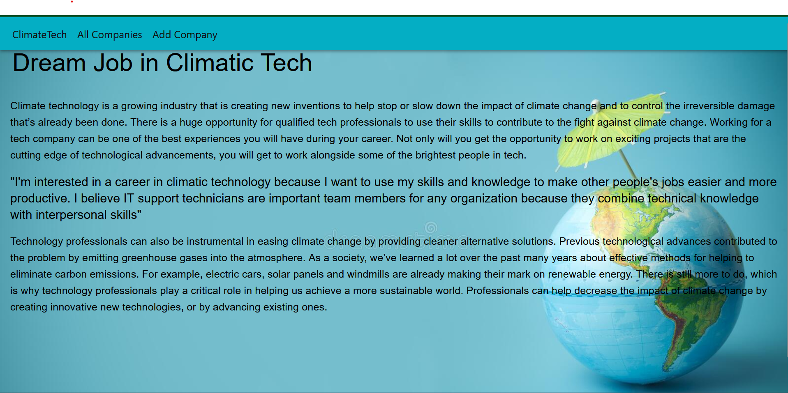
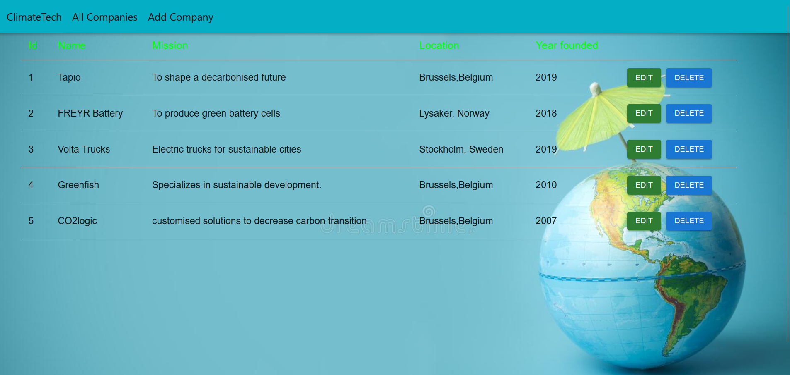
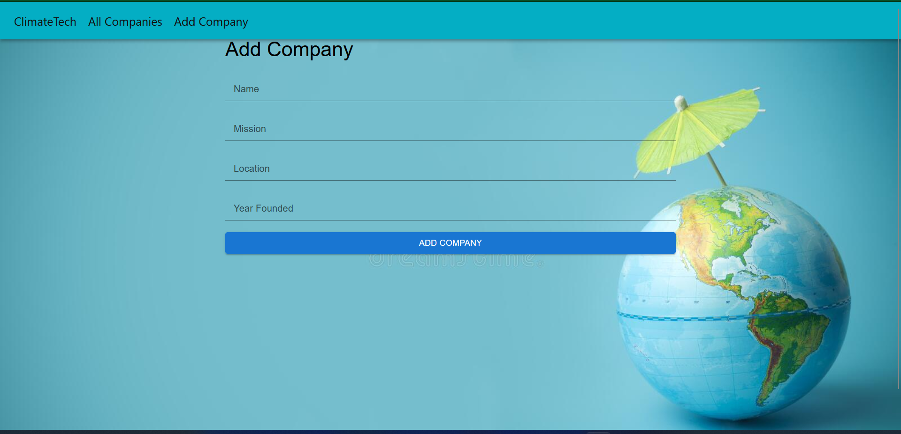
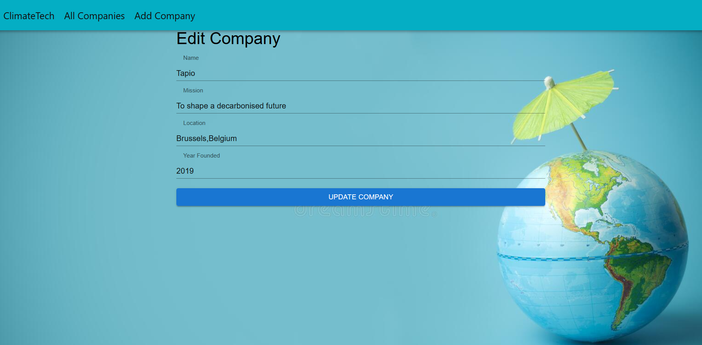

# Getting Started with Create React App

This project was bootstrapped with [Create React App](https://github.com/facebook/create-react-app).

## General info

> A simple CRUD application using React and JSONPlaceholder API .Climatic Tech job explains the need of Professionals to decrease the impact of climate change by creating innovative new technologies, or by advancing existing ones.

## Available Scripts

In the project directory, you can run:

### `npm start`

Runs the app in the development mode.\
Open [http://localhost:3000](http://localhost:3000) to view it in your browser.

The page will reload when you make changes.\
You may also see any lint errors in the console.

### `npm run json-server`

Start using json-server in your project by running `npm i json-server`
add  "json-server": "json-server --watch src/Database/db.json --host 127.0.0.1 --port 3002", to package json script

### `npm run build`

Builds the app for production to the `build` folder.\
It correctly bundles React in production mode and optimizes the build for the best performance.

The build is minified and the filenames include the hashes.\
Your app is ready to be deployed!

See the section about [deployment](https://facebook.github.io/create-react-app/docs/deployment) for more information.

## Tools and Technologies

### UX/UI

### Frontend

- Node 14.16.0
- VSC code
- JavaScript
- React Material UI

### Backend

- Node
- json
- axios

### Devops

- Netlify
- Github

## Screenshots

- ClimateTech

- AllCompanies

- AddCompanies

- Editpage

